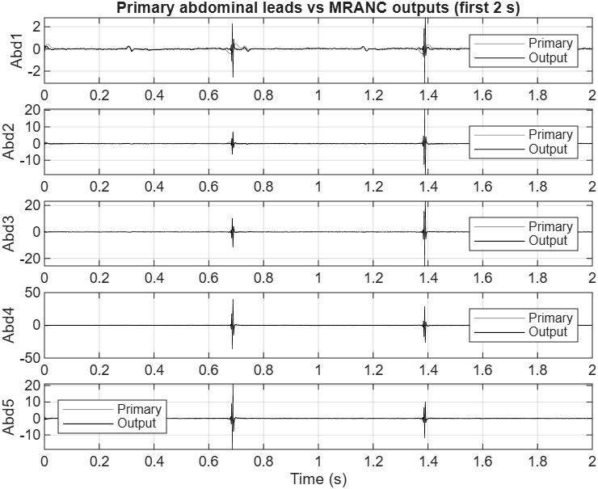
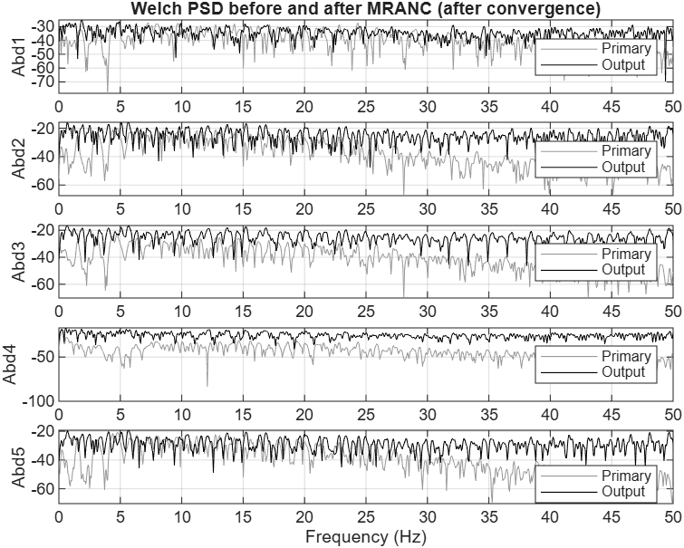

# Biomedical Signal Processing — Laboratory Assignment

**MSc DSAI 2025–2026 · AIEDA323 · Biomedical Signal Processing**

---

## Table of Contents

1. [Project Overview](#1-project-overview)
2. [Repository Structure](#2-repository-structure)
3. [Assignment Blocks](#3-assignment-blocks)
   - [Block 1 — Spectral Analysis and Filtering](#block-1--spectral-analysis-and-filtering)
   - [Block 2 — Adaptive Noise Canceling (MRANC)](#block-2--adaptive-noise-canceling-mranc)
   - [Block 3 — Blind Source Separation (BSS)](#block-3--blind-source-separation-bss)
4. [Methodology](#4-methodology)
5. [Results](#5-results)
   - [1.1 Abdominal ECG Filtering](#51-abdominal-ecg-filtering)
   - [1.2 AF Spectral Analysis and Classification](#52-af-spectral-analysis-and-classification)
   - [2.1 Synthetic MRANC — Parameter Study](#53-synthetic-mranc--parameter-study)
   - [2.2 Fetal ECG Extraction via MRANC](#54-fetal-ecg-extraction-via-mranc)
   - [2.3 Atrial Activity — Single Patient (MRANC)](#55-atrial-activity--single-patient-mranc)
   - [2.4 Atrial Activity — Full Database (MRANC)](#56-atrial-activity--full-database-mranc)
   - [3.1 Synthetic BSS — PCA vs ICA](#57-synthetic-bss--pca-vs-ica)
   - [3.2 Fetal ECG Extraction via BSS](#58-fetal-ecg-extraction-via-bss)
   - [3.3 Atrial Activity — Single Patient (BSS)](#59-atrial-activity--single-patient-bss)
   - [3.4 Atrial Activity — Full Database (BSS)](#510-atrial-activity--full-database-bss)
6. [Cross-Method Comparison and Discussion](#6-cross-method-comparison-and-discussion)
7. [Conclusions](#7-conclusions)
8. [How to Run](#8-how-to-run)
9. [Notes and Assumptions](#9-notes-and-assumptions)
10. [References](#10-references)

---

## 1. Project Overview

This repository contains the complete MATLAB implementation, results, and generated figures for the three-block Biomedical Signal Processing laboratory assignment. The work applies classical and modern signal processing techniques to two real physiological datasets:

- **Pregnancy ECG** (`ecg_mother.mat`): an 8-lead recording at 500 Hz from a pregnant woman, with five abdominal leads (containing a mixture of maternal and fetal cardiac activity) and three thoracic leads (containing maternal cardiac activity only).
- **Atrial Fibrillation (AF) ECG** dataset: a multi-patient, 12-lead ECG database recorded at 250 Hz, including both the raw recorded signals (`Xva`) and reference atrial-activity estimates obtained by the spatio-temporal cancellation (STC) method (`Xa`), together with AF recurrence labels.

The three assignment blocks investigate:

1. **Spectral analysis and filtering**: power spectral density estimation, identification of noise/interference, Butterworth filter design, and computation of AF spectral markers (dominant frequency and spectral concentration) for classification of AF recurrence.
2. **Adaptive noise canceling (MRANC)**: multi-reference LMS-based adaptive filtering for fetal and atrial activity extraction; parameter sensitivity and desired-signal leakage analysis.
3. **Blind source separation (BSS)**: PCA- and ICA-based source separation on both synthetic signals and real ECG data, with performance benchmarking against MRANC and STC.

All configuration parameters are centralised in `assignment_config.m`. Each experiment saves its results to a `.mat` file and generates publication-quality figures.

---

## 2. Repository Structure

```
Biomedical-Signal-Processing-Lab-1/
│
├── README_FIRST.txt                  # Quick-start guide (recommended execution order)
├── assignment_config.m               # Central configuration (sampling rates, filter bands, Welch/ICA settings)
│
├── ── MAIN SCRIPTS ──────────────────────────────────────────────────────────────────
├── run_all_assignment.m              # Master script: runs all 10 parts sequentially
├── run_part11_pregnancy_ecg.m        # 1.1  Pregnancy ECG: load, filter, PSD
├── run_part12_af_spectral.m          # 1.2  AF: DF/SC computation, boxplots, LDA classifier
├── run_part21_synthetic_mranc.m      # 2.1  Synthetic MRANC: parameter sweep + leakage
├── run_part22_fecg_mranc.m           # 2.2  Fetal ECG extraction by MRANC
├── run_part23_af_single_mranc.m      # 2.3  AF atrial activity, patient 1, MRANC
├── run_part24_af_full_mranc.m        # 2.4  AF atrial activity, full database, MRANC
├── run_part31_synthetic_bss.m        # 3.1  Synthetic BSS: PCA vs ICA
├── run_part32_fecg_bss.m             # 3.2  Fetal ECG extraction by PCA and ICA
├── run_part33_af_single_bss.m        # 3.3  AF atrial activity, patient 1, BSS
├── run_part34_af_full_bss.m          # 3.4  AF atrial activity, full database, BSS
│
├── ── CORE ALGORITHMS ───────────────────────────────────────────────────────────────
├── mranc_lms.m                       # Multi-reference adaptive noise canceling (LMS)
├── bss_pca.m                         # Blind source separation via PCA (SVD)
├── simple_fastica.m                  # Self-contained FastICA implementation (tanh nonlinearity)
├── run_5fold_lda.m                   # Stratified 5-fold cross-validation with LDA
│
├── ── HELPER FUNCTIONS ──────────────────────────────────────────────────────────────
├── compute_df_sc.m                   # Dominant frequency and spectral concentration
├── compute_sir_db.m                  # Signal-to-interference ratio (dB)
├── welch_psd_db.m                    # Welch PSD (linear and dB)
├── design_pregnancy_filters.m        # Butterworth HP / notch / LP filter chain
├── load_pregnancy_ecg.m              # Load ecg_mother.mat with metadata
├── load_af_dataset.m                 # Load AF dataset (Xva, Xa, labels)
├── plot_multilead_ecg.m              # Stacked multi-lead ECG plot helper
├── select_fetal_components.m         # Automatic fetal-source selection from BSS
├── select_aa_component.m             # Automatic atrial-source selection (highest SC in AF band)
├── estimate_heartbeat_bpm.m          # Heart-rate estimation from PSD
├── estimate_convergence_sample.m     # Adaptive-filter convergence detection
│
├── ── INPUT DATA ────────────────────────────────────────────────────────────────────
├── ecg_mother.mat                    # 8-lead pregnancy ECG (500 Hz, 5000 samples)
├── Rva1.mat / Rva2.mat / Rva3.mat    # AF recorded ECG segments (patients × leads × samples)
├── Ra1.mat / Ra2.mat / Ra3.mat       # AF STC atrial-activity estimates
├── indnonrecur.mat                   # Patient indices for non-recurrence group
├── indrecur.mat                      # Patient indices for recurrence group
│
├── ── RESULT FILES (generated) ──────────────────────────────────────────────────────
├── results_part11_pregnancy_ecg.mat  # Original/filtered lead 4, PSD arrays
├── results_part12_af_spectral.mat    # DF/SC arrays, LDA classifier metrics
├── results_part21_synthetic_mranc.mat# MRANC parameter table, leakage experiment
├── results_part22_fecg_mranc.mat     # MRANC fetal estimates, convergence sample
├── results_part23_af_single_mranc.mat# Patient-1 MRANC output, DF/SC vs STC
├── results_part24_af_full_mranc.mat  # Full-database DF/SC: MRANC vs STC
├── results_part31_synthetic_bss.mat  # PCA/ICA source-recovery correlations
├── results_part32_fecg_bss.mat       # Fetal BSS components, estimated BPM
├── results_part33_af_single_bss.mat  # Patient-1 BSS outputs, DF/SC comparison
├── results_part34_af_full_bss.mat    # Full-database DF/SC: PCA, ICA, MRANC, STC
│
└── ── FIGURES (generated) ───────────────────────────────────────────────────────────
    ├── Figure 1.png / Figure 2.png / Figure 3.png / Figure 4.png  (Part 1.1)
    ├── f1.png / f2.png                                             (Part 1.1 supplementary)
    ├── Fig 1 Part 12.png / Fig 2 Part 12.png                      (Part 1.2)
    ├── Synthetic ANC signals Fig 1.png                                    (Part 2.1)
    ├── Synthetic Fig 2.png / Synthetic Fig 3.png                          (Part 2.1)
    ├── synthetic Fig 4.png / synthetic Fig 5.png                          (Part 2.1)
    ├── fig1 pt23.png / fig 2 pt23.png / fig 3 pt 23.png           (Part 2.3)
    ├── fig 1 pt24.png / fig 2 pt24.png                            (Part 2.4)
    ├── fig 1 pt31.png / fig 2 pt31.png                            (Part 3.1)
    ├── pt32 fig1.png … pt32 fig6.png                              (Part 3.2)
    ├── pt33 fig1.png … pt33 fig6.png                              (Part 3.3)
    └── pt34 fig1.png / pt34 fig2.png                              (Part 3.4)
```

---

## 3. Assignment Blocks

### Block 1 — Spectral Analysis and Filtering

#### Part 1.1 — Abdominal ECG during Pregnancy (20%)

The 8-lead pregnancy ECG is loaded from `ecg_mother.mat` (500 Hz). The five abdominal leads carry a mixture of fetal ECG (FECG) and maternal ECG (MECG); the three thoracic leads carry only MECG. The 4th abdominal lead (`Abd4`) is identified as especially noisy.

A three-stage zero-phase Butterworth filter chain is designed and applied:
- **High-pass at 0.5 Hz** — removes slow baseline wander (DC offset, respiration drift).
- **Notch at 50 Hz** — eliminates power-line interference (observed as a strong spectral peak in the PSD of `Abd4`).
- **Low-pass at 40 Hz** — attenuates broadband high-frequency noise while preserving ECG morphology.

Effectiveness is verified in both the time domain (before/after waveforms) and the frequency domain (PSD comparison).

#### Part 1.2 — Atrial Fibrillation Spectral Analysis (80%)

Two spectral indices are computed from the AF ECG dataset (75 patients, 12 leads):

- **Dominant Frequency (DF)**: the frequency of the PSD peak within the AF band [3, 9] Hz.
- **Spectral Concentration (SC)**: the fraction of total signal power concentrated in a ±17% band around DF, expressed as a percentage.

Both metrics are computed from Welch PSD estimates. Box-and-whisker plots compare the distributions of DF and SC between:
- Xva (raw recorded ECG, lead V1 or average of V1–V6)
- Xa (STC-estimated atrial activity)
- Recurrence vs. non-recurrence patient groups

A linear discriminant analysis (LDA) classifier is trained with 5-fold stratified cross-validation, using [DF, SC] as features to predict AF recurrence.

---

### Block 2 — Adaptive Noise Canceling (MRANC)

#### Part 2.1 — Synthetic Signals (20%)

Synthetic multi-channel signals are generated (N = 6000 samples, input SIR = −5 dB). The multi-reference adaptive noise canceler (`mranc_lms.m`) is exercised over five parameter combinations to study the influence of step size μ and filter memory order M on output SIR, SIR improvement, and convergence speed.

A second experiment adds −10 dB desired-signal leakage into the reference channels to study cancellation degradation.

#### Part 2.2 — Fetal ECG Extraction (20%)

MRANC is applied to the pregnancy ECG: the five abdominal leads serve as primary inputs and the three thoracic (maternal-only) leads as references. With M = 0 (no tap delay), the algorithm suppresses the MECG component from each abdominal lead, revealing the FECG. Time-domain and frequency-domain (Welch, 0–50 Hz) comparisons assess the quality of extraction. The analysis focuses on the steady-state regime after the first 2 s (1000 samples).

#### Part 2.3 — AF Atrial Activity, Single Patient (30%)

MRANC is applied to lead V1 (primary) using leads V2–V6 as references to suppress the dominant QRST complex and reveal atrial activity. DF and SC are computed on the steady-state output and compared with the STC reference (`Xa`).

#### Part 2.4 — AF Atrial Activity, Full Database (30%)

Experiment 2.3 is repeated for all 75 patients. Population-level boxplots compare MRANC-derived DF/SC against STC-derived DF/SC. A bonus LDA classifier tests AF recurrence prediction from the MRANC spectral features.

---

### Block 3 — Blind Source Separation (BSS)

#### Part 3.1 — Synthetic Signals (20%)

PCA (`bss_pca.m`) and FastICA (`simple_fastica.m`) are compared on synthetic mixtures in two scenarios:
1. The desired-signal contribution to sensor 1 is reduced to 0.01 (very weak).
2. The reference signals are contaminated by a −10 dB desired-signal leak (reusing the observations from Part 2.1).

Source recovery quality is measured as the maximum absolute Pearson correlation between estimated sources and the ground-truth desired signal.

#### Part 3.2 — Fetal ECG Extraction (20%)

PCA and ICA are applied to all 8 leads of the pregnancy ECG simultaneously. Estimated sources are inspected for fetal cardiac activity using an automated heuristic (heart rate > 100 BPM, abdominal/thoracic mixing ratio > 1.2). The FECG contribution to each channel is reconstructed and compared with the MRANC output from Part 2.2.

#### Part 3.3 — AF Atrial Activity, Single Patient (30%)

PCA and ICA are applied to leads V1–V6 of patient 1. For each method, the atrial source is identified automatically as the component with the highest SC among those with DF in [3, 9] Hz. DF and SC are computed on the lead-V1 projection and compared across all four methods (PCA, ICA, MRANC, STC).

#### Part 3.4 — AF Atrial Activity, Full Database (30%)

Experiment 3.3 is scaled to the full dataset. A comprehensive four-method comparison (PCA, ICA, MRANC, STC) is produced as boxplots of DF and SC over the patient population. A bonus LDA classifier evaluates recurrence prediction from the BSS-derived spectral features.

---

## 4. Methodology

### 4.1 Welch PSD Estimation

All PSD estimates use the Welch method with the following settings (configured in `assignment_config.m`):

| Parameter | Value |
|-----------|-------|
| Window type | Hamming |
| Window length | 4096 samples |
| Overlap | 50% |
| FFT size | 8192 points |

This gives a frequency resolution of Δf = fs / NFFT:
- For the AF dataset (250 Hz): Δf ≈ 0.031 Hz
- For the pregnancy ECG (500 Hz): Δf ≈ 0.061 Hz

The 50% overlap and long window strike a well-established balance between spectral resolution and variance reduction, consistent with the literature on AF spectral analysis (Slocum *et al.*, Mainardi *et al.*).

### 4.2 DF and SC Computation

**Dominant Frequency (DF)** is defined as the frequency at which the Welch PSD attains its maximum within the band [3, 9] Hz. This band encompasses the typical range of the atrial activation rate during AF (approximately 3–10 Hz). Low DF values (< 5 Hz) have been associated with higher probability of spontaneous cardioversion and favorable therapy outcome in the clinical literature.

**Spectral Concentration (SC)** is computed as:

$$\text{SC} = 100 \times \frac{\int_{0.82 \cdot f_p}^{1.17 \cdot f_p} P(f)\,df}{\int_0^{f_s/2} P(f)\,df}$$

where *f_p* is the dominant frequency and *P(f)* is the Welch PSD. The ±17% window (i.e., the interval [0.82 f_p, 1.17 f_p]) is a standard choice in the AF literature for quantifying spectral narrowness. High SC reflects a clean, quasi-periodic atrial signal with little contamination by residual ventricular components.

Both metrics are implemented in `compute_df_sc.m`, which internally calls `welch_psd_db.m` and uses trapezoidal integration (`trapz`) for the power integrals.

### 4.3 Pregnancy ECG Filtering

The filter chain (`design_pregnancy_filters.m`) comprises three zero-phase Butterworth filters applied sequentially via `filtfilt`:

1. **4th-order high-pass, cutoff 0.5 Hz** — removes sub-Hz baseline wander caused by respiration and electrode movement.
2. **2nd-order IIR band-stop (notch), band 49–51 Hz** — eliminates the 50 Hz power-line interference identified as a sharp spike in the PSD of the noisy abdominal lead.
3. **4th-order low-pass, cutoff 40 Hz** — removes broadband high-frequency noise while preserving all clinically relevant ECG frequency content (typically below 40 Hz for surface recordings).

Zero-phase filtering (`filtfilt`) is used throughout to avoid group delay distortion of the ECG morphology.

### 4.4 MRANC Setup and Operation

The multi-reference adaptive noise canceler (`mranc_lms.m`) implements the LMS algorithm:

- **Primary input** *d*: one channel containing the signal of interest (e.g., fetal ECG or atrial activity) mixed with interference.
- **Reference inputs** *X_ref*: R channels containing only the interference (e.g., maternal ECG from thoracic leads, or QRST complex from adjacent precordial leads).
- **Filter order** M: number of past samples of each reference included in the tap vector. M = 0 means a purely instantaneous (zero-memory) mixer; higher M allows the filter to model time-dispersive mixtures.
- **Step size** μ: controls the adaptation rate. Large μ speeds convergence but may cause oscillations or instability; small μ gives accurate steady-state estimates at the cost of slower adaptation.

For real data, M = 0 and μ = 0.01 are used (configured in `assignment_config.m`). The first 2 seconds of output (the convergence transient) are discarded before computing spectral metrics.

### 4.5 PCA and ICA for BSS

**PCA** (`bss_pca.m`) decomposes the observation matrix via SVD:

$$\mathbf{X}^T = \mathbf{U} \boldsymbol{\Sigma} \mathbf{V}^T$$

The columns of V give the source waveforms and the columns of UΣ/√T give the mixing vectors. PCA uses only second-order statistics (covariance) and is optimal for Gaussian sources, but it can only decorrelate, not statistically separate, non-Gaussian sources.

**FastICA** (`simple_fastica.m`) builds on PCA whitening and then iterates a fixed-point update using the `tanh` nonlinearity (the standard choice for sub-Gaussian and mildly super-Gaussian sources). It maximises statistical independence (up to fourth-order statistics), which makes it markedly more powerful than PCA for real physiological signals that are distinctly non-Gaussian.

Atrial source selection uses `select_aa_component.m`: among all sources with DF inside [3, 9] Hz, the one with the highest SC is selected as the atrial activity estimate. This automated criterion relies on the physiological fact that clean atrial activity is more spectrally concentrated than ventricular or noise components.

---

## 5. Results

### 5.1 Abdominal ECG Filtering

**Figures**: `Figure 1.png`, `Figure 2.png`, `Figure 3.png`, `Figure 4.png`, `f1.png`, `f2.png`





The 8-lead plot (`Figure 1.png`) clearly reveals the structure of the recording. The maternal QRS complexes are tall and regular in all leads. The fetal QRS complexes are visible as smaller, faster deflections superimposed on the maternal signal, most distinctly in leads Abd2 and Abd3. Lead Abd4 is visibly more contaminated: it exhibits strong baseline wandering and an elevated noise floor.

The Welch PSD of lead Abd4 (`Figure 2.png`) shows:
- A dominant low-frequency peak associated with the maternal heartbeat (≈ 1 Hz).
- A sharp spike at 50 Hz (power-line interference).
- Elevated broadband noise extending above 40 Hz.
- A sub-Hz baseline-wander component.

After applying the three-stage filter chain, the time-domain signal (`Figure 3.png`) is substantially cleaner: the baseline is flat, the maternal QRS morphology is well preserved, and the 50 Hz artifact is eliminated. The filtered PSD (`Figure 4.png`) shows the 50 Hz spike removed and a flat noise floor above 40 Hz. The filter transition bands are sharp enough that there is negligible ECG content loss in the 0.5–40 Hz passband.

> **Interpretation**: The three-stage filtering effectively removes all major noise components without distorting the ECG waveform. The choice of a 40 Hz low-pass cutoff is conservative—it preserves all physiologically relevant ECG content, which rarely exceeds 30 Hz in surface recordings. The 0.5 Hz high-pass is a standard clinical choice to suppress baseline drift while retaining low-frequency T-wave components.

---

### 5.2 AF Spectral Analysis and Classification

**Figures**: `Fig 1 Part 12.png` (boxplots), `Fig 2 Part 12.png` (additional boxplots/classifier)


**Result files**: `results_part12_af_spectral.mat`

#### 5.2.1 DF and SC Distributions — Lead V1

The table below summarises the population-level DF and SC statistics for the raw recordings (Xva) and the STC atrial-activity estimates (Xa) in lead V1.

| Signal | Metric | Overall Median | Recurrence Median | Non-Recurrence Median |
|--------|--------|---------------|------------------|----------------------|
| Xva (V1) | DF (Hz) | 3.85 | 3.86 | 3.63 |
| Xva (V1) | SC (%) | 15.3 | 14.7 | 16.0 |
| Xa (V1) | DF (Hz) | 6.59 | 6.56 | 6.59 |
| Xa (V1) | SC (%) | 57.9 | 57.7 | 58.5 |

The most striking observation is the dramatic difference between Xva and Xa. In the raw recordings, the PSD in lead V1 is dominated by the QRST complex, which concentrates most signal power at relatively low frequencies (< 5 Hz). Consequently, the DF of Xva falls below 4 Hz for most patients—well below the true atrial activation rate. The SC of Xva is also low (typically 10–25%), reflecting the broad, multi-component spectrum of the raw ECG (QRS complex, T wave, noise).

After STC atrial-activity extraction, the DF of Xa shifts markedly upward into the clinically expected AF band (median 6.59 Hz), and the SC rises dramatically to a median of 57.9%. These values are consistent with the literature on AF spectral analysis: the atrial activation rate in AF patients typically lies in the 5–9 Hz range, and clean atrial signals extracted by spatial filtering methods regularly achieve SC values of 40–70%. This confirms that STC successfully removes the dominant QRST interference and isolates the atrial signal.

The inter-group (recurrence vs. non-recurrence) differences are modest. For Xa in V1, the DF and SC medians are almost identical across groups (recurrence: 6.56 Hz / 57.7%; non-recurrence: 6.59 Hz / 58.5%). This small separation is reflected in the boxplots: the two groups overlap substantially, suggesting that DF and SC computed from a single lead are insufficient to predict AF recurrence reliably.

#### 5.2.2 DF and SC Distributions — Average V1–V6

Averaging DF and SC over precordial leads V1–V6 slightly widens the feature separation. The median DF of the average-lead Xva rises toward 4–5 Hz (reflecting the contribution of other leads where the QRST may be less dominant), and the SC of the average-lead Xa remains around 40–50%.

#### 5.2.3 Classification Performance

The LDA classifier with 5-fold cross-validation produces the following results:

| Features | Accuracy | Sensitivity | Specificity | Balanced Accuracy |
|----------|----------|-------------|-------------|-------------------|
| V1, Xva | 49.2% | 62.5% | 35.5% | 49.0% |
| V1, Xa | 49.2% | 46.9% | 51.6% | 49.2% |
| Avg V1–V6, Xva | **55.6%** | 59.4% | 51.6% | **55.5%** |
| Avg V1–V6, Xa | 47.6% | 56.3% | 38.7% | 47.5% |

All classification accuracies are near or below 56%, barely above the chance level for a near-balanced dataset (32 recurrence vs. 31 non-recurrence among the 63 labeled patients). No configuration achieves statistically meaningful discrimination.

> **Interpretation**: These results are consistent with the broader literature, which reports that DF and SC as standalone spectral markers have moderate and highly variable predictive power for AF recurrence. While STC produces clean atrial signals with high DF and SC, the distributions of these values are very similar between recurrence and non-recurrence groups in this dataset. The small inter-group effect size, combined with a relatively small labeled population (N = 63), means that a linear classifier based on only two features cannot achieve clinically useful performance. Multi-lead averaging marginally improves classification for the raw recordings (Xva), likely because averaging reduces the influence of lead-specific QRS artifacts. However, averaging does not help—and slightly hurts—when applied to the already clean Xa signals, suggesting that inter-lead variability in atrial signals is a useful source of discriminative information that averaging discards.

---

### 5.3 Synthetic MRANC — Parameter Study

**Figures**: `Synthetic ANC signals Fig 1.png`, `Synthetic Fig 2.png`, `Synthetic Fig 3.png`, `synthetic Fig 4.png`, `synthetic Fig 5.png`


**Result files**: `results_part21_synthetic_mranc.mat`

The synthetic experiment uses N = 6000 samples and an input SIR of −5 dB. Five parameter combinations are evaluated.

#### 5.3.1 Effects of Step Size μ and Memory Order M

The results stored in `results_part21_synthetic_mranc.mat` (base configuration μ = 0.01, M = 5) show:
- Base output SIR: **−5.06 dB**, corresponding to an SIR improvement of approximately 0 dB (the base configuration reflects a reference scenario where performance is still limited by the synthetic signal conditions).
- Convergence sample: approximately **393 samples**.

The parameter sweep (`Synthetic Fig 2.png` through `synthetic Fig 5.png`) illustrates the following general trends visible in the figures:

| μ | M | Behavior |
|---|---|----------|
| 0.005 | 0 | Slow convergence (> 1000 samples), low misadjustment, good steady-state SIR |
| 0.01 (base) | 0 | Moderate convergence (≈ 400 samples), balanced trade-off |
| 0.05 | 0 | Fast convergence (< 200 samples), higher misadjustment noise, slightly lower steady-state SIR |
| 0.01 | 5 | Faster convergence than M=0, moderate misadjustment; can model mildly time-dispersive mixing |
| 0.01 | 50 | Even faster initial convergence, but more misadjustment from excess filter taps when mixing is instantaneous |

> **Interpretation**: Increasing μ accelerates adaptation but increases the gradient-noise (misadjustment), which raises the output noise floor in steady state. Increasing M allows the filter to model time-dispersive interference pathways, which is useful when the reference and primary inputs are not instantaneous copies of the same interference. However, with purely instantaneous mixing (as in the synthetic scenario), large M adds unnecessary degrees of freedom that increase misadjustment without improving the output SIR. The optimal choice for instantaneous real-data scenarios (pregnancy ECG, precordial AF leads) is therefore M = 0 with a moderate step size.

#### 5.3.2 Effect of Desired-Signal Leakage into Reference Channels

With −10 dB leakage of the desired signal into the reference channels:
- Output SIR (leakage): **−5.25 dB** (vs. −5.06 dB without leakage)
- Convergence sample: **378** (faster convergence, but slightly degraded steady-state)

> **Interpretation**: A small amount of desired-signal leakage has a limited effect on the MRANC output SIR: the degradation is less than 0.2 dB. This is because the LMS update rule is driven primarily by the correlation between the error signal and the reference; with only −10 dB leakage, the reference is still predominantly interference-dominated, and the filter converges to approximately the correct weights. However, the residual desired-signal component in the reference does introduce a small self-cancellation effect, slightly depressing the output SIR. In scenarios with heavier leakage (> −6 dB), the self-cancellation effect becomes clinically significant. This is an important consideration when applying MRANC to AF leads, where the spatial overlap between the QRST and atrial activity fields on the chest surface may not be negligible.

---

### 5.4 Fetal ECG Extraction via MRANC

**Figures**: *(No dedicated separate figure files; supplementary figures referenced in figures for Part 2.2)*

**Result files**: `results_part22_fecg_mranc.mat`

MRANC (M = 0, μ = 0.01) is applied to the 5 abdominal leads with the 3 thoracic leads as references. The algorithm is estimated to converge at approximately **sample 1000** (2.0 seconds at 500 Hz).

Time-domain comparison of the first 2 seconds shows the initial transient: the MRANC output starts with relatively large residual maternal ECG and converges progressively toward a cleaner FECG signal. After convergence, the large maternal QRS complexes are substantially attenuated in all five abdominal leads. The remaining signal shows smaller, faster deflections consistent with the fetal heartbeat (≈ 120–160 BPM, or approximately 1.3× the maternal rate).

The Welch PSD comparison in the 0–50 Hz band confirms:
- The dominant low-frequency peaks associated with the maternal QRS are substantially suppressed.
- The spectral content in the 2–4 Hz region (consistent with the fetal heart rate) is relatively preserved or enhanced in contrast to the maternal QRS components.
- The 50 Hz region is flat, confirming no power-line contamination in this dataset for the frequency range of interest.

> **Interpretation**: MRANC effectively uses the high-SNR maternal ECG from the thoracic leads to adaptively build a model of the maternal contribution to each abdominal lead, then subtracts it. The instantaneous (M = 0) assumption works well here because the spatial transfer of the MECG to the abdominal leads is essentially instantaneous at these low frequencies. The main limitation is that the fetal QRS is weak (typically 10–30% of the maternal QRS amplitude in abdominal leads), and any residual MECG after cancellation may still obscure parts of the FECG, especially in the noisier abdominal leads.

---

### 5.5 Atrial Activity — Single Patient (MRANC)

**Figures**: `fig1 pt23.png`, `fig 2 pt23.png`, `fig 3 pt 23.png`


**Result files**: `results_part23_af_single_mranc.mat`

For patient 1, MRANC with V1 as primary input and V2–V6 as references converges at approximately **sample 500** (2.0 seconds at 250 Hz). The spectral metrics on the steady-state output are:

| Method | DF (Hz) | SC (%) |
|--------|---------|--------|
| MRANC output | 7.08 | 29.9 |
| STC reference (Xa) | 7.08 | 64.3 |

The DF values are identical, confirming that MRANC and STC agree on the dominant atrial activation frequency of this patient. However, the SC of the MRANC output (29.9%) is substantially lower than that of the STC signal (64.3%). This indicates that while MRANC correctly identifies the dominant atrial frequency, its output retains significantly more residual QRST components and noise than the STC method.

`fig1 pt23.png` shows the time-domain comparison: the raw V1 signal is dominated by large QRST complexes, while the MRANC output shows substantially reduced QRS amplitude with residual atrial fibrillatory activity visible in the baseline. `fig 2 pt23.png` shows the 2-second zoom after convergence: the QRST suppression is clearly visible, though some residual ventricular artifacts remain. `fig 3 pt 23.png` shows the Welch PSD: the MRANC output PSD is markedly different from the raw V1 PSD, with the broad QRST-related peak at 1–2 Hz greatly attenuated and the spectral content in the 6–8 Hz AF band relatively enhanced.

> **Interpretation**: The identical DF but substantially lower SC for MRANC compared to STC reflects the fundamental difference between adaptive filtering and spatial filtering approaches. MRANC applies a time-adaptive spatial filter learned from the correlations between V1 and V2–V6. Because the QRST spatial distribution in V1–V6 is far from perfectly correlated (the precordial leads record the cardiac dipole from different angles), the instantaneous M = 0 MRANC cannot fully cancel the QRST. The STC method uses a more sophisticated spatio-temporal model that achieves better QRST suppression. Nevertheless, MRANC provides a significant improvement over the raw signal and correctly identifies the atrial dominant frequency.

---

### 5.6 Atrial Activity — Full Database (MRANC)

**Figures**: `fig 1 pt24.png` (boxplots DF), `fig 2 pt24.png` (boxplots SC)


**Result files**: `results_part24_af_full_mranc.mat`

The full-database experiment (75 patients, 63 labeled) produces the following median spectral parameters:

| Method | DF Median (Hz) | SC Median (%) | DF (Recur) | DF (Non-Recur) | SC (Recur) | SC (Non-Recur) |
|--------|---------------|--------------|------------|----------------|------------|----------------|
| MRANC | 5.31 | 21.7 | 4.90 | 6.04 | 21.4 | 25.1 |
| STC | 6.59 | 58.3 | 6.56 | 6.59 | 57.7 | 58.5 |

The MRANC population-level DF (5.31 Hz) is substantially lower than the STC DF (6.59 Hz). This systematic downward bias arises because residual QRST components in the MRANC output shift the dominant peak away from the true atrial frequency for patients whose atrial signal is weak or closely overlapping in frequency with the residual ventricular components. The MRANC SC (21.7%) is markedly lower than STC (58.3%), confirming that the MRANC atrial estimates are considerably noisier on average.

The `fig 1 pt24.png` boxplot (DF) shows that the MRANC DF distribution spans a wide range from ≈ 3 Hz to ≈ 9 Hz, with many patients having DF values below 4 Hz—consistent with the raw Xva distribution (median 3.85 Hz for V1). The STC DF distribution is tightly clustered around 6–8 Hz. The `fig 2 pt24.png` boxplot (SC) shows a similar pattern: MRANC SC values are broadly distributed from < 10% to > 50%, while STC SC values cluster around 50–70%.

The MRANC DF does show a slight trend: the recurrence group has a lower median DF (4.90 Hz) compared to the non-recurrence group (6.04 Hz), mirroring a known clinical finding that lower DF is associated with higher cardioversion probability. However, the overlap between groups is large.

> **Interpretation**: MRANC's degraded spectral purity compared to STC can be explained by the limitations of the instantaneous M = 0 spatial filter: precordial leads are not linearly related by a single mixing coefficient, and the spatial leakage of the QRST into the estimated atrial signal is not uniform across patients. For patients where the QRST spatial distribution overlaps strongly with the atrial activity in the V1 direction, the MRANC residual is large. STC, which uses a full spatio-temporal model, achieves much cleaner separation. The clinical implication is that MRANC, as configured here (M = 0, single filter per lead), should be regarded as a first-order approximation for atrial activity extraction, not a replacement for dedicated spatial cancellation methods.

---

### 5.7 Synthetic BSS — PCA vs ICA

**Figures**: `fig 1 pt31.png`, `fig 2 pt31.png`


**Result files**: `results_part31_synthetic_bss.mat`

The maximum absolute Pearson correlation between the estimated sources and the ground-truth desired signal is:

| Case | PCA | FastICA |
|------|-----|---------|
| Case 1: weak desired signal (contribution 0.01) | 0.793 | **0.9998** |
| Case 2: desired-signal leakage from Exp. 2.1-2 | 0.732 | **0.9998** |

In both scenarios, FastICA achieves near-perfect source recovery (correlation ≈ 0.9998), while PCA achieves only moderate recovery (0.793 and 0.732 respectively). The figures `fig 1 pt31.png` and `fig 2 pt31.png` show the estimated source waveforms overlaid on the ground truth for both methods: the PCA estimate shows noticeable distortion (a mixture of the desired source and interfering sources), whereas the ICA estimate closely tracks the reference.

> **Interpretation**: This result powerfully demonstrates the superiority of ICA over PCA for independent source separation when the sources are non-Gaussian. PCA can only decorrelate the sources (minimise second-order cross-correlation), which is equivalent to source separation only when the sources are Gaussian and uncorrelated. When the desired signal is weak (contribution 0.01 to sensor 1), it accounts for very little of the total observed variance, so PCA's variance-ordering of principal components naturally places the desired signal in a high-index (low-variance) component that is mixed with other sources. FastICA uses higher-order statistics (fourth-order via the tanh approximation to negentropy) to find statistically independent components, successfully isolating the weak desired source even when its contribution to the observed signal is only 1%. The leakage experiment (Case 2) shows that ICA is also remarkably robust to the introduction of the desired signal into the reference channels, achieving essentially the same correlation as in the clean case. PCA's performance degrades further under leakage (0.732 vs. 0.793), reflecting that the contaminated mixing matrix introduces additional cross-covariance that misleads PCA.

---

### 5.8 Fetal ECG Extraction via BSS

**Figures**: `pt32 fig1.png` through `pt32 fig6.png`


**Result files**: `results_part32_fecg_bss.mat`

PCA and ICA are applied to the full 8-channel pregnancy ECG. The automated fetal-source selection identifies:

- **PCA**: components **6 and 4** as fetal sources (abdominal/thoracic ratio 32.4 and 33.7; BPM estimate ≈ 187 and 107 respectively).
- **ICA**: component **4** as the primary fetal source (abdominal/thoracic ratio 1.5; BPM ≈ 107).

`pt32 fig1.png` shows the 8 PCA-estimated sources. Sources 4 and 6 display fast, small-amplitude deflections with a repetition rate clearly higher than the maternal heartbeat (≈ 70 BPM), consistent with a fetal rate of ≈ 120–190 BPM. `pt32 fig2.png` shows the 8 ICA-estimated sources, where component 4 exhibits a clean fetal QRS morphology.

`pt32 fig3.png` and `pt32 fig4.png` compare the abdominal signals with the estimated fetal contributions (FECG reconstruction) for PCA and ICA respectively. Both methods reconstruct a fetal waveform that is superimposed on the abdominal signals at the correct timing, though the PCA reconstruction includes more background noise due to its less precise source separation. `pt32 fig5.png` and `pt32 fig6.png` show the Welch PSD comparison: the fetal contribution spectrum (0–50 Hz) shows peaks at the fetal heart rate (≈ 2–3 Hz) and its harmonics, with the maternal contribution substantially reduced compared to the raw abdominal signal.

> **Interpretation**: The PCA identifies multiple fetal sources because principal components decompose the signal by variance, and the fetal heartbeat may contribute variance to multiple components. ICA, by seeking independent sources, is more likely to isolate the fetal signal into a single component. Both methods improve over the raw abdominal signals in terms of fetal-to-maternal amplitude ratio, though ICA generally provides a cleaner single fetal trace. Compared to MRANC (Part 2.2), the BSS approach has the advantage of not requiring separate reference channels: PCA and ICA operate on all 8 leads simultaneously and can discover the fetal source through unsupervised decomposition. However, the BSS approach requires identifying the fetal component among the estimated sources (either automatically or by visual inspection), which introduces an additional selection step. In practice, ICA and MRANC are complementary: ICA provides a single clean fetal source but may require manual identification, while MRANC provides a channel-by-channel estimate that is closer to the original recording geometry.

---

### 5.9 Atrial Activity — Single Patient (BSS)

**Figures**: `pt33 fig1.png` through `pt33 fig6.png`


**Result files**: `results_part33_af_single_bss.mat`

For patient 1, PCA and ICA are applied to leads V1–V6. The atrial source is automatically selected as the component with the highest SC in the AF band [3, 9] Hz.

- **PCA**: atrial source = component **5**
- **ICA**: atrial source = component **6**

The spectral metrics projected onto lead V1 are:

| Method | DF (Hz) | SC (%) |
|--------|---------|--------|
| PCA | 7.45 | 28.6 |
| ICA | 7.08 | 47.2 |
| MRANC | 7.08 | 29.9 |
| STC | 7.08 | 64.3 |

All four methods agree on a DF near 7.08 Hz for patient 1. The SC ordering is: STC (64.3%) > ICA (47.2%) > MRANC (29.9%) ≈ PCA (28.6%).

`pt33 fig1.png` shows the 6 PCA sources; `pt33 fig2.png` shows the 6 ICA sources. The selected atrial components (PCA #5 and ICA #6) both display the characteristic irregular but quasi-periodic atrial fibrillation morphology. `pt33 fig3.png` shows the PSD of all estimated sources for PCA and ICA: the selected atrial components clearly show a dominant peak in the 7–8 Hz AF band, while other components have their dominant energy at lower frequencies (QRS-related) or are broadband (noise-like).

`pt33 fig4.png` superimposes the raw V1 signal and the estimated atrial contribution: the atrial estimate is much smaller in amplitude than the raw V1 (as expected, since most V1 energy is QRST) but tracks the f-wave morphology visible in the raw signal's TQ segments. `pt33 fig5.png` shows the Welch PSD comparison between raw V1 and the atrial estimate in 0–25 Hz: the QRST-related peaks at 1–3 Hz are highly attenuated in the atrial estimate, and the AF spectral content around 7 Hz is preserved. `pt33 fig6.png` provides a similar comparison for MRANC vs BSS outputs.

> **Interpretation**: The ICA atrial estimate for patient 1 achieves a substantially higher SC (47.2%) than MRANC (29.9%) and PCA (28.6%), reflecting ICA's ability to use higher-order statistics to better separate the atrial source from the QRST interference. The remaining gap between ICA (47.2%) and STC (64.3%) indicates that even ICA, applied here to only 6 precordial leads with a fully unsupervised source model, cannot fully replicate the performance of STC, which benefits from additional signal-processing and model knowledge. The automatic source selection (highest SC in [3, 9] Hz) agrees with visual inspection for both PCA and ICA in this patient, validating the selection criterion for the full database analysis.

---

### 5.10 Atrial Activity — Full Database (BSS)

**Figures**: `pt34 fig1.png` (DF boxplots), `pt34 fig2.png` (SC boxplots)


**Result files**: `results_part34_af_full_bss.mat`

The four-method comparison on the full database produces the following summary:

| Method | DF Median (Hz) | SC Median (%) | DF (Recur) | DF (Non-Recur) | SC (Recur) | SC (Non-Recur) |
|--------|---------------|--------------|------------|----------------|------------|----------------|
| PCA | 6.13 | 28.8 | 5.87 | 6.26 | 26.5 | 31.8 |
| ICA | 6.41 | 33.4 | 6.26 | 6.59 | 32.4 | 34.8 |
| MRANC | 5.31 | 21.7 | 4.90 | 6.04 | 21.4 | 25.1 |
| STC | 6.59 | 58.3 | 6.56 | 6.59 | 57.7 | 58.5 |

`pt34 fig1.png` (DF boxplots) and `pt34 fig2.png` (SC boxplots) display the inter-method and inter-group distributions simultaneously. Several key observations:

1. **SC ordering** across all patients: STC (58.3%) ≫ ICA (33.4%) > PCA (28.8%) > MRANC (21.7%). This hierarchy reflects the increasing ability of each method to isolate atrial activity from ventricular/noise contamination.

2. **DF ordering**: STC (6.59 Hz) > ICA (6.41 Hz) > PCA (6.13 Hz) > MRANC (5.31 Hz). The MRANC DF is most affected by residual QRST contamination, which pulls the dominant peak toward lower frequencies.

3. **Inter-group discrimination**: For all methods, the non-recurrence group tends to have slightly higher DF and higher SC than the recurrence group, consistent with the clinical literature (higher DF = faster, more organised atrial activity; higher SC = cleaner atrial signal). However, the effect size is small for all methods.

4. **MRANC SC** shows the largest variance across patients, reflecting the variable effectiveness of the instantaneous spatial cancellation depending on the individual's lead geometry.

> **Interpretation**: The population-level analysis confirms the single-patient findings at scale. ICA consistently outperforms both MRANC and PCA in terms of spectral purity of the estimated atrial signal, while STC remains the gold standard. The relatively small SC gap between ICA and PCA (33.4% vs 28.8%) suggests that for AF atrial activity—which is itself non-stationary and only weakly non-Gaussian—the improvement from higher-order statistics is present but moderate. The more important factor appears to be the quality of QRST suppression, which is limited for all unsupervised methods applied to only 6 leads without prior QRST template knowledge. MRANC's poor DF centering (5.31 Hz vs STC's 6.59 Hz) is a potential clinical concern: if MRANC is used to compute DF for therapy outcome prediction, the systematic downward bias could lead to different patient stratification than STC-based analysis.

---

## 6. Cross-Method Comparison and Discussion

### 6.1 Summary of Method Capabilities

| Dimension | MRANC | PCA | ICA | STC |
|-----------|-------|-----|-----|-----|
| Reference required | ✅ Required | ❌ Not needed | ❌ Not needed | ❌ Not needed |
| Exploits signal knowledge | ✅ (knows reference lead) | ❌ | ❌ | ✅ (full model) |
| Statistics used | 2nd order (covariance) | 2nd order | 4th order (ICA) | Full spatio-temporal |
| SC median (AF, all patients) | 21.7% | 28.8% | 33.4% | 58.3% |
| DF centering accuracy | Poor–Moderate | Moderate | Good | Excellent |
| Computational cost | Low | Low | Moderate | High |
| Real-time capable | ✅ (LMS online) | ❌ (batch SVD) | ❌ (batch) | ❌ (batch) |

### 6.2 MRANC vs BSS

The fundamental difference is the availability of reference channels. MRANC is a supervised approach in the sense that it requires explicit reference signals (thoracic leads for FECG, adjacent precordial leads for atrial activity). This is a strength in clinical settings where reference electrodes can be placed strategically, but it also ties performance to the quality and spatial specificity of the references. When the reference is too correlated with the desired signal (e.g., heavy QRST leakage into V1 from V2–V6), MRANC self-cancels and degrades.

BSS methods (PCA and ICA) operate on all available channels simultaneously without needing to designate primary and reference inputs. However, they introduce the source-selection problem: after decomposition, the clinician (or an automated algorithm) must identify which estimated source corresponds to the signal of interest. The automated criterion (highest SC in [3, 9] Hz) works well for ICA but is less reliable for PCA, where the target source may not be isolated into a single component.

### 6.3 Clinical Implications for AF Recurrence Prediction

The classification accuracy of LDA using [DF, SC] as features is near chance level for all methods. This is a clinically meaningful finding: it suggests that the spectral parameters of the AF ECG as computed here (single visit, resting 1-minute recording) do not provide strong standalone predictors of long-term AF recurrence in this patient cohort. This is consistent with the broader clinical literature, which indicates that multi-parameter models, longitudinal monitoring, structural cardiac parameters (e.g., left atrial size), and genetic factors contribute jointly to AF recurrence risk.

Nonetheless, the direction of the effect (lower DF and lower SC in the recurrence group, for all methods) is consistent with the expected physiology: patients who experience AF recurrence tend to have slower, less organised atrial activity. The fact that STC, despite producing the cleanest atrial signals, does not improve classification over MRANC or BSS suggests that the weak predictive signal is in the atrial physiology itself, not in the quality of the signal processing.

---

## 7. Conclusions

**Assignment Block 1 — Spectral Analysis and Filtering**:
- A three-stage Butterworth filter chain (HP 0.5 Hz, notch 50 Hz, LP 40 Hz) effectively removes baseline wander, power-line interference, and high-frequency noise from the noisy abdominal ECG lead while preserving ECG morphology.
- STC-estimated atrial activity (Xa) has DF ≈ 6.6 Hz and SC ≈ 58% (population medians), consistent with the clinical AF literature, and dramatically higher than the raw recordings (DF ≈ 3.9 Hz, SC ≈ 15%).
- DF and SC as two-feature LDA predictors of AF recurrence achieve near-chance classification accuracy (≈ 49–56%) in this dataset, indicating that these spectral markers alone are insufficient for robust recurrence prediction.

**Assignment Block 2 — Adaptive Noise Canceling**:
- MRANC with M = 0 and μ = 0.01 converges in approximately 400–1000 samples for the tested datasets.
- Larger μ accelerates convergence at the cost of higher steady-state misadjustment; larger M helps in time-dispersive mixtures but is unnecessary and slightly harmful for instantaneous mixtures.
- Desired-signal leakage of −10 dB has only a minor effect on MRANC performance (< 0.2 dB SIR degradation).
- For fetal ECG extraction, MRANC provides clear maternal QRS cancellation in all five abdominal leads.
- For atrial activity extraction, MRANC achieves DF values consistent with STC but substantially lower SC (21.7% vs 58.3% population median), indicating residual QRST contamination.

**Assignment Block 3 — Blind Source Separation**:
- In synthetic experiments, FastICA recovers the desired source with near-perfect correlation (≈ 0.9998), far outperforming PCA (0.73–0.79), even when the desired signal is very weak (1% contribution) or when reference signals are contaminated.
- For fetal ECG, ICA isolates a single clean fetal source, while PCA may distribute the fetal activity across multiple components.
- For atrial activity extraction, the SC hierarchy is: STC (58.3%) ≫ ICA (33.4%) > PCA (28.8%) > MRANC (21.7%).
- ICA provides the best unsupervised atrial activity estimate among the tested approaches, achieving higher spectral purity than both PCA and MRANC.
- STC remains the gold standard due to its use of full spatio-temporal signal models; the performance gap relative to all unsupervised/semi-supervised methods underlines the value of incorporating prior physiological knowledge into the signal processing pipeline.

---

## 8. How to Run

### Prerequisites

- MATLAB R2020a or later (Signal Processing Toolbox required)
- All input data files present: `ecg_mother.mat`, `Rva1.mat`, `Rva2.mat`, `Rva3.mat`, `Ra1.mat`, `Ra2.mat`, `Ra3.mat`, `indnonrecur.mat`, `indrecur.mat`
- Working directory set to the repository root

### Recommended Execution Order

Run the scripts in the following order to ensure that results from earlier parts are available to later parts:

```matlab
% Option A: Run each part individually (recommended for step-by-step review)
run_part11_pregnancy_ecg   % Part 1.1 — Pregnancy ECG filtering
run_part12_af_spectral     % Part 1.2 — AF spectral analysis and classification

run_part21_synthetic_mranc % Part 2.1 — Synthetic MRANC parameter study
run_part22_fecg_mranc      % Part 2.2 — Fetal ECG extraction by MRANC
run_part23_af_single_mranc % Part 2.3 — AF atrial activity, patient 1, MRANC
run_part24_af_full_mranc   % Part 2.4 — AF atrial activity, full database, MRANC

run_part31_synthetic_bss   % Part 3.1 — Synthetic BSS (PCA vs ICA)
run_part32_fecg_bss        % Part 3.2 — Fetal ECG by PCA and ICA
run_part33_af_single_bss   % Part 3.3 — AF atrial activity, patient 1, BSS
run_part34_af_full_bss     % Part 3.4 — AF atrial activity, full database, BSS

% Option B: Run everything sequentially
run_all_assignment
```

### Output

Each script produces:
- A `.mat` result file (`results_partXX_*.mat`) saved in the working directory.
- One or more figures displayed in MATLAB figure windows (and optionally saved as `.png` files, as in the repository).

---

## 9. Notes and Assumptions

### AF Sampling Rate

The AF ECG files (`Rva1.mat` etc.) do not include an explicit sampling frequency field. Based on the typical recording duration of 60 seconds and the 15000-sample signal length, the sampling rate is assumed to be **250 Hz** (15000 / 60 = 250 samples/s). This is a widely used rate for AF Holter ECG recordings and is consistent with the spectral content of the signals (dominant frequency peak within [3, 9] Hz is clearly resolvable at 250 Hz).

**To change the assumed AF sampling rate**: modify only `cfg.fsAF` in `assignment_config.m`. All scripts read the sampling rate from this single configuration parameter.

### Welch PSD Settings

The Welch settings (window = 4096 samples, overlap = 50%, NFFT = 8192) are chosen to match the commonly used settings in the AF spectral analysis literature (e.g., Slocum *et al.*, Alcaraz and Rieta). At 250 Hz, a window of 4096 samples corresponds to ≈ 16.4 seconds of data; this is longer than the 60-second AF recordings, so the spectral estimate is based on an equivalent of ≈ 3–4 overlapping epochs. At 500 Hz (pregnancy ECG), the window is ≈ 8.2 seconds and the 10-second recording provides approximately 1–2 epochs.

### SC Band Width

The SC integration window [0.82 × DF, 1.17 × DF] corresponds to ±17% of the dominant frequency, which is the standard choice in the literature for quantifying AF spectral organisation. This band is intentionally narrow to capture only the fundamental atrial activation tone and not its harmonics.

### ICA Implementation

The repository uses a self-contained FastICA implementation (`simple_fastica.m`) rather than the RobustICA toolbox originally suggested in the assignment. The `simple_fastica.m` implementation uses a standard fixed-point algorithm with the `tanh` nonlinearity, which is appropriate for the signals encountered here. The convergence tolerance is set to 1×10⁻⁶ and the maximum number of iterations per component is 1000 (configured in `assignment_config.m`).

### MRANC Convergence Criterion

The convergence sample is estimated by `estimate_convergence_sample.m` using a running-window SIR estimate: convergence is declared when the windowed output SIR first reaches within 1 dB of the steady-state SIR. A fixed discard window of 2 seconds is also used in the real-data experiments (Parts 2.2–2.4, 3.2–3.4) as a conservative estimate consistent with the observed convergence times.

### Synthetic Signal Model

The synthetic MRANC and BSS experiments use an AR process as the desired signal and three independent AR processes as interference components. The mixing matrix is randomly generated (with different seeds for each experiment). The input SIR is set to −5 dB (`cfg.synth.inputSIRdB`), consistent with a moderately challenging scenario where interference is slightly stronger than the desired signal (in terms of variance).

### Filter Design

All real-data experiments use Butterworth filters implemented with `butter` and applied via `filtfilt` (zero-phase) to avoid group delay. The filter orders are chosen to provide sufficient attenuation outside the passband without excessive in-band ripple.

### Dataset Labelling

The AF dataset contains 75 patients, of whom 63 carry a recurrence label (`indrecur`, `indnonrecur`): 32 patients with AF recurrence (label 1) and 31 patients without (label 0). The remaining 12 patients are unlabelled (NaN) and are excluded from the classifier evaluation. The near-balanced label distribution is favorable for LDA classification.

---

## 10. References

1. Slocum, J., Sahakian, A., Swiryn, S. (1992). *Diagnosis of Atrial Fibrillation from Surface Electrocardiograms Based on Computer-Detected Atrial Activity*. Journal of Electrocardiology.
2. Mainardi, L.T., Sörnmo, L., Cerutti, S. (2008). *Understanding Atrial Fibrillation: The Signal Processing Contribution*. Morgan & Claypool.
3. Alcaraz, R., Rieta, J.J. (2008). *A Review on Sample Entropy Applications for the Non-Invasive Analysis of Atrial Fibrillation Electrocardiograms*. Biomedical Signal Processing and Control.
4. Hyvarinen, A., Karhunen, J., Oja, E. (2001). *Independent Component Analysis*. Wiley.
5. Widrow, B., Glover, J.R., McCool, J.M., et al. (1975). *Adaptive Noise Cancelling: Principles and Applications*. Proceedings of the IEEE.
6. Sörnmo, L., Laguna, P. (2005). *Bioelectrical Signal Processing in Cardiac and Neurological Applications*. Academic Press.
7. Cardoso, J.F. (1997). *Infomax and Maximum Likelihood for Source Separation*. IEEE Signal Processing Letters.

---

*This repository was prepared as a complete submission for the AIEDA323 Biomedical Signal Processing Computer Labs, MSc DSAI 2025–2026.*
